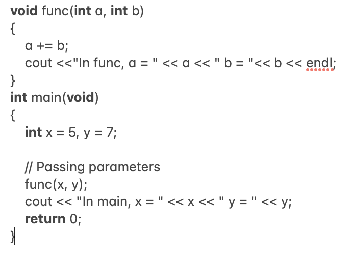
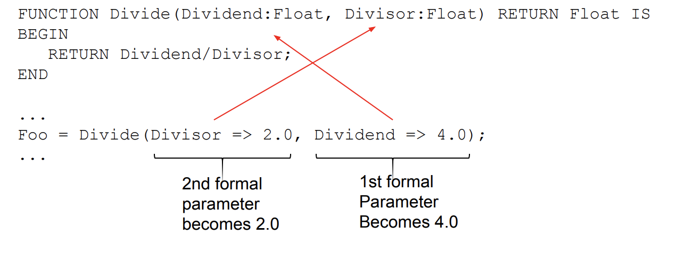

# Week-7 Memory & Java tutorial by Jimmy Zhang
**Note:** Before starting Learn the basic of [java](https://www.w3schools.com/java/)

## Memory Locations For Variables & Java
in modern programming languages there are many different classes of variables such as the following:
1. Global variables
2. Parameter
3. Local variables
4. OO
5. and etc..
language system keep track of the value of the variables during the runtime of a program.
in a imperative program it is clear, however in a funtional language it not so obvious due to the fact that there is no global state. despite that it is still bound to memory location. This is a achieved by binding it to a memory location and storing the value of the variable

**What is activations record?**

An Activation Record is a data structure that is activated/ created when a procedure/function is invoked Basically, it stores the status of the current activation function. So, whenever a function call occurs, then a new activation record is created and it will be pushed onto the top of the stack.

## Memory Management & Java
For most part of memory management there are static and dynamic parts
- static - global data, compiled codes, runtime system.
- dynamic - runtime stack and heap 

**What is a stack?**

The stack is a LIFO (Last-In-First-Out) data structure. manage using push and pop.

In the stack, as you said, things are "separated" and you can only get at whatever's on top. The operating system uses a stack to manage local variables in functions and procedures. Let's imagine you have a function in a function in a function (let's say f1() calls f2() which in turn calls f3() ):

When the first function (f1) is executed, you have its variables available; when that function calls another, all of f1's variables get pushed into the stack and the new function's variables (f2) take over. When THAT function calls f3, it is f2's variables that get pushed into the stack. 

**Advantage**
- fast
_ auto manged by the progam (function)
**Disadvantage**
- manage by program not the dev (so not flexible)

**What is a heap?**

The heap stores dynamic memory values that are requested on runtime. In additon, programmer needs to maintain the memory. Not fast, but durable across function calls

**Advantage** 
- manage the dev (flexible)
**Disadvantage**
- time in execution( not fast)
- memory leak
- buffer overflow 

Using the the language in C++ heap is call using **malloc or memory allocation**. 

It is basically asaking the system for the amount of memory is asked for and return a pointer to the starting address. Thus freeing up the memory, 
which it can be use for other purposes.

Automatic memory management works by the process of **Garbage collection or GC**. GC takes place by pausing the execution and going through the whole program to free up unused memory blocks. The advantage of this is that it keep the  module cleaner(fewer  bugs)

A **dangling pointer** is a pointer that points to invalid data or to data which is not valid anymore

A **memory leak** is when a user ask for memory that was never freed

**What is execption?**

An **exception** is an event, which occurs during the execution of a program, that disrupts the normal flow of the program's instructions

Example of this

**Checked vs. Unchecked Exceptions** 
- uncheck are exceptions that do not have to be caught by an explicit try/catch block. These typically represent unrecoverable errors or unforseen/unplannable exceptions
- check are exception that you have to catch with an explicit try/catch block if they could be thrown. Typically, these are common errors that you should be able to know how to handle or recover from.

## Parameter 
so let start out by using an example in C++

How is the correspondence between actual and formal parameters established?

- Most programming languages use positional parameters; 
- The first actual parameter is assigned to the first formal parameter
- The second actual parameter is assigned to the second formal parameters and so on 

**keyword parameter**

- In Keyword Parameter the position does not matter 

**Parameter Value Transmission**
there are three different techniques of this 
1. by value
2. by reference
3. value-result 

**Call by value**
- In call by value, the actual parameter and formal parameter is different. So changes made to formal parameter are not reflected back.

**Call by reference**
- In call by reference, actual and formal parameter are same. So changes made are directly reflected back.

**Call by value-result**
- In call by value result, actual and formal parameter is different. But when function ends, the value of formal parameter is copied back to actual parameter. So changes are reflected.

practice and example can be found on https://www.javatpoint.com/call-by-value-and-call-by-reference-in-java and - https://www.youtube.com/watch?v=frFBNwEIAcA&ab_channel=LernenInVerschiedenenFormen

## reference 
- “Activation Records.” GeeksforGeeks, 15 June 2022, https://www.geeksforgeeks.org/access-links-and-control-links/. 
“Difference between Call by Value and Call by Reference.” GeeksforGeeks, 16 June 2022, https://www.geeksforgeeks.org/difference-between-call-by-value-and-call-by-reference/. 
- “Functioncall: What Are ‘Call by Result’ / ‘Call by Value Result’ Parameters? ( Check Description! ).” YouTube, YouTube, 28 Jan. 2018, https://www.youtube.com/watch?v=frFBNwEIAcA&amp;ab_channel=LernenInVerschiedenenFormen. 
- Pierce, Doug. “Most Common Java Exceptions.” Rollbar, 23 June 2022, https://rollbar.com/blog/most-common-java-exceptions/#:~:text=Error%20%2D%20errors%20are%20exceptions%20that,but%20are%20not%20typically%20recoverable. 
- Young Coder. “An Illustrated Guide to Memory Management and Garbage Collection.” Medium, Young Coder, 16 Jan. 2020, https://medium.com/young-coder/an-illustrated-guide-to-memory-management-and-garbage-collection-9ae74d1d9efa. 
- Young Coder. “An Illustrated Guide to the Stack, the Heap, and Pointers.” Medium, Young Coder, 16 Jan. 2020, https://medium.com/young-coder/an-illustrated-guide-to-memory-the-stack-the-heap-and-pointers-40a604f7bc53. 
- Webber, Adam. Modern Programming Languages: A Practical Introduction. Franklin, Beedle &amp; Associates, 2002. 
